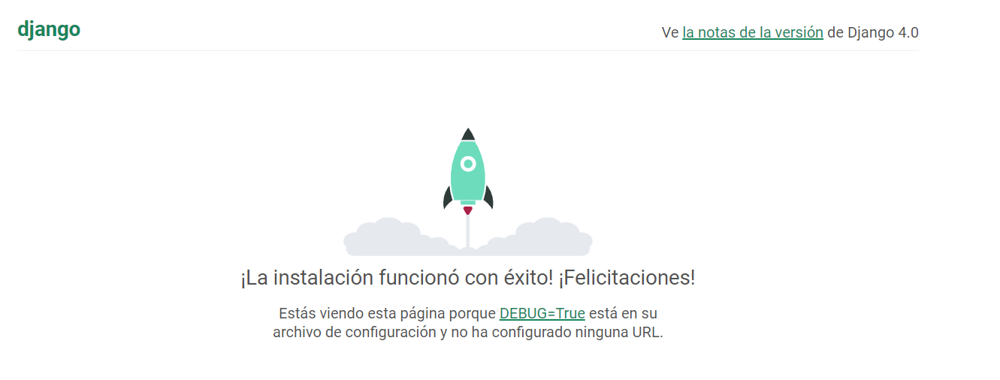
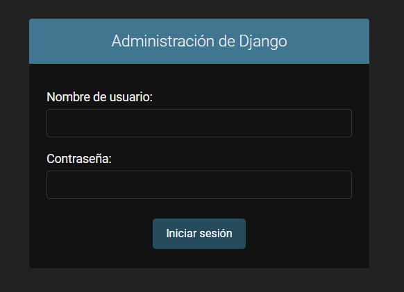
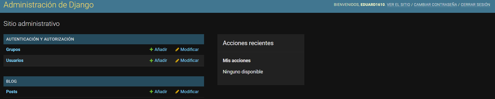
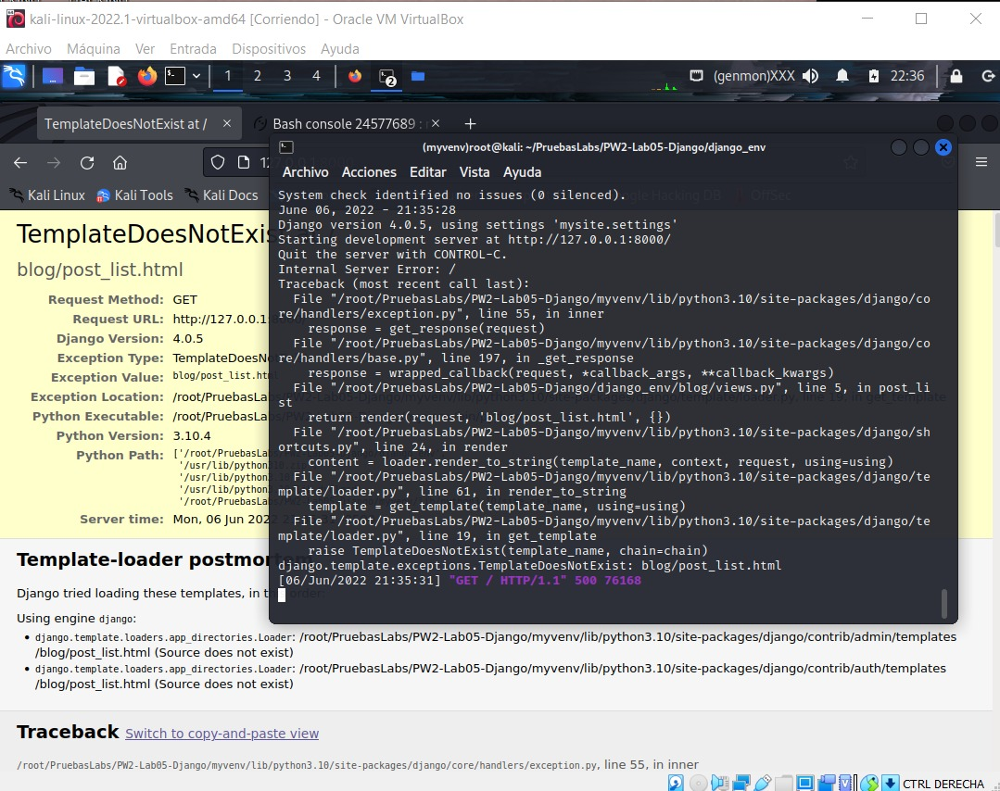
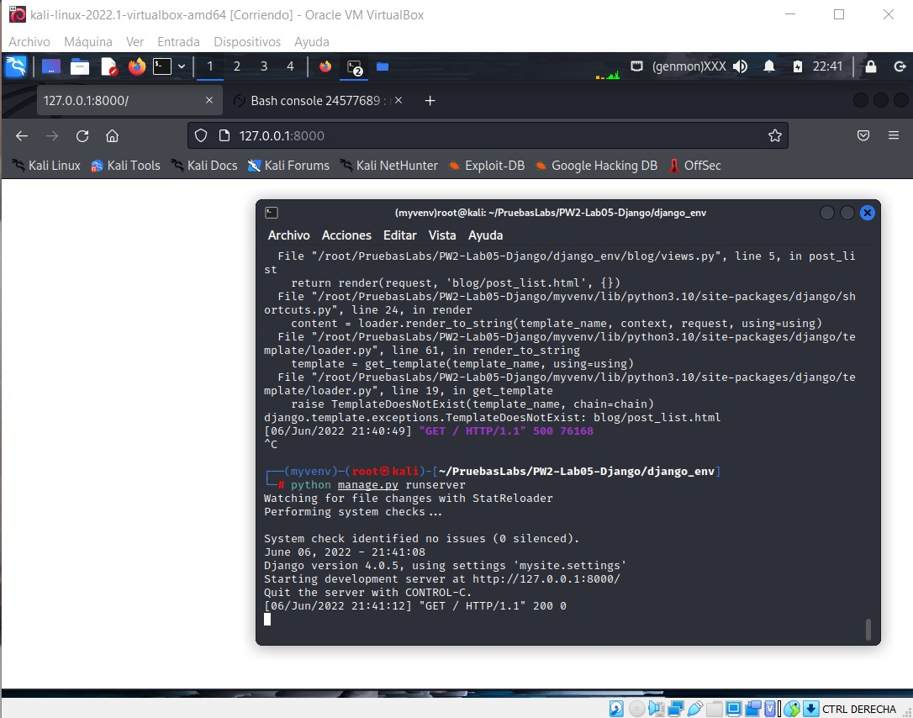
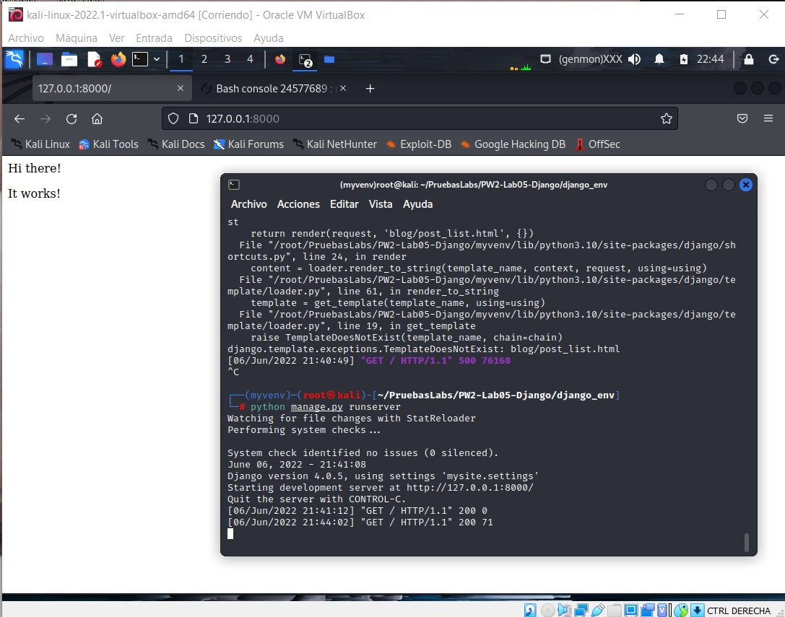
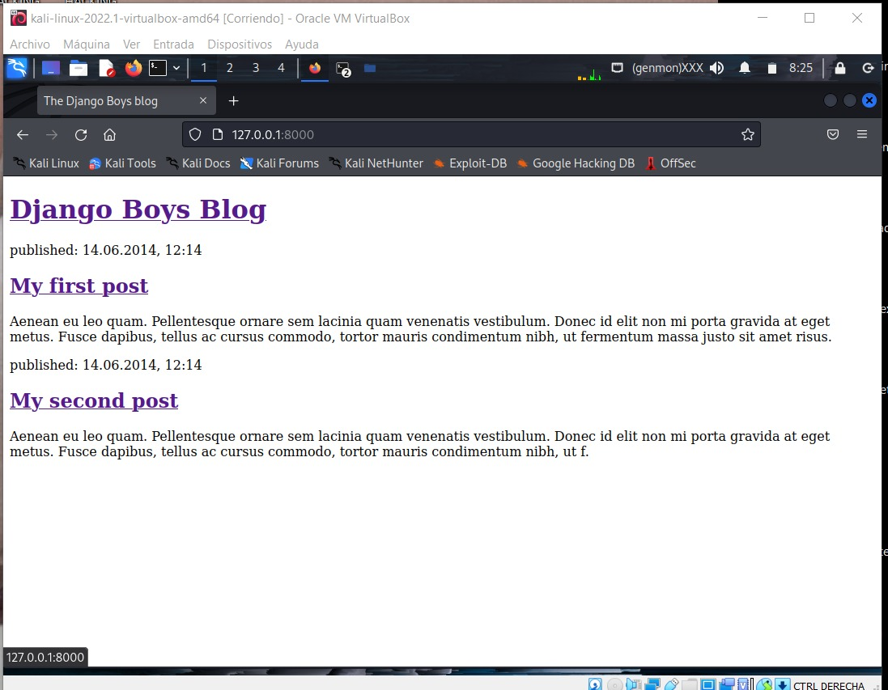
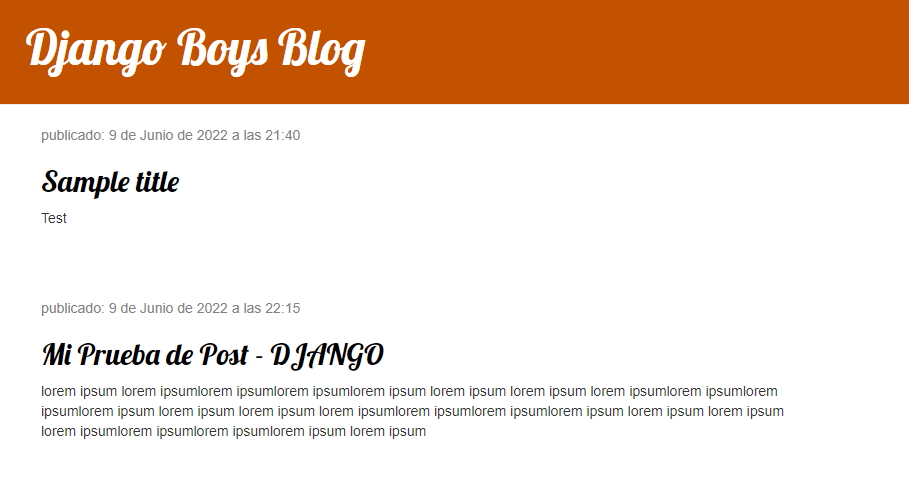

<div align="center">
<table>
    <theader>
        <tr>
            <td></td>
            <th>
                <span style="font-weight:bold;">UNIVERSIDAD NACIONAL DE SAN AGUSTIN</span><br />
                <span style="font-weight:bold;">FACULTAD DE INGENIERÍA DE PRODUCCIÓN Y SERVICIOS</span><br />
                <span style="font-weight:bold;">DEPARTAMENTO ACADÉMICO DE INGENIERÍA DE SISTEMAS E INFORMÁTICA</span><br />
                <span style="font-weight:bold;">ESCUELA PROFESIONAL DE INGENIERÍA DE SISTEMAS</span>
            </th>
            <td></td>
        </tr>
    </theader>
    <tbody>
        <tr><td colspan="3"><span style="font-weight:bold;">Formato</span>: Guía de Práctica de Laboratorio</td></tr>
        <tr><td><span style="font-weight:bold;">Aprobación</span>:  2022/03/01</td><td><span style="font-weight:bold;">Código</span>: GUIA-PRLD-001</td><td><span style="font-weight:bold;">Página</span>: 1</td></tr>
    </tbody>
</table>
</div>

<div align="center">
<span style="font-weight:bold;">INFORME DE LABORATORIO</span><br />
</div>


<table>
<theader>
<tr><th colspan="6">INFORMACIÓN BÁSICA</th></tr>
</theader>
<tbody>
<tr><td>ASIGNATURA:</td><td colspan="5">Programación Web 2</td></tr>
<tr><td>TÍTULO DE LA PRÁCTICA:</td><td colspan="5">Django</td></tr>
<tr>
<td>NÚMERO DE PRÁCTICA:</td><td>05</td><td>AÑO LECTIVO:</td><td>2022 A</td><td>NRO. SEMESTRE:</td><td>III</td>
</tr>
<tr>
<td>FECHA INICIO::</td><td>30-May-2022</td><td>FECHA FIN:</td><td>03-Jun-2022</td><td>DURACIÓN:</td><td>04 horas</td>
</tr>
<tr><td colspan="6">Integrantes:
    <ul>
        <li>Durand Obando, Eduardo Franshua</li>
        <li>Tejada Lazo, Jordy Rolando</li>
        <li>Hurtado Beajano, Michael Steve</li>
        <li>Chua Agular, Jean Carlo Leonel</li>
    </ul>
</td>
</<tr>
<tr><td colspan="6">DOCENTES:
<ul>
<li>Richart Smith Escobedo Quispe - rescobedoq@unsa.edu.pe</li>
</ul>
</td>
</<tr>
</tdbody>
</table>

# Django

[![License][license]][license-file]
[![Downloads][downloads]][releases]
[![Last Commit][last-commit]][releases]

[![Debian][Debian]][debian-site]
[![Git][Git]][git-site]
[![GitHub][GitHub]][github-site]
[![Vim][Vim]][vim-site]
[![Java][Java]][java-site]

#

## OBJETIVOS TEMAS Y COMPETENCIAS

### OBJETIVOS

-   Crear un Proyecto Django dentro de un entorno virtual.

### TEMAS
-   Entorno virtual
-   Django
-   Modelos
-   Migraciones
-   Panel de administración

<details>
<summary>COMPETENCIAS</summary>

- C.c Diseña responsablemente sistemas, componentes o procesos para satisfacer necesidades dentro de restricciones realistas: económicas, medio ambientales, sociales, políticas, éticas, de salud, de seguridad, manufacturación y sostenibilidad.
- C.m Construye responsablemente soluciones siguiendo un proceso adecuado llevando a cabo las pruebas ajustada a los recursos disponibles del cliente.
- C.p Aplica de forma flexible técnicas, métodos, principios, normas, estándares y herramientas de ingeniería necesarias para la construcción de software e implementación de sistemas de información.

</details>

#
## DESARROLLO DEL BLOG


-   Crea un blog sencillo en un entorno virtual utilizando la guía: https://tutorial.djangogirls.org/es/django_start_project/
-   Especificar paso a paso la creación del blog en su informe.

Clonamos el repositorio actual, luego:
1) Crear el entorno virtual, primero ingresamos dentro de "django_env" y en la consola de comandos ejecutamos<code> virtualenv -p python3 env</code> se creará una carpeta llamada env.
    ```sh
        django_env
        └── env
    ```

2) En la misma consola activamos el entorno virtual con el comando <code>.\env\Scripts\activate</code> para windows y <code>source env/bin/activate</code> para Mac OS / Linux. Una vez ejecutado el comando podremos ver que se agregó(env) al inicio, indicador de que estamos en un entorno virtual.
    ```sh
        (env) PS D:\Unsa\pw2\PW2-Lab05-Django\django_env>
    ```

3) Comprobamos si tenemos Django instalado usando <code>pip list</code>, como no lo encontramos, instalaremos Django dentro del entorno virtual usando <code>pip install Django</code>, volvemos a usar <code>pip list</code> para confirmar que se instaló correctamente.
    ```sh
        Package    Version
        ---------- -------
        asgiref    3.5.2
        Django     4.0.5
        pip        22.0.4
        setuptools 62.1.0
        sqlparse   0.4.2
        tzdata     2022.1
        wheel      0.37.1
    ```
    Obviamos el resto de paquetes y observamos que ya tenemos Django instalado.

4) Usamos el comando <code>python manage.py migrate</code> para guardar los cambios. Debería mostrarse lo siguiente:
    ```sh
        Operations to perform:
        Apply all migrations: admin, auth, blog, contenttypes, sessions
        Running migrations:
        Applying contenttypes.0001_initial... OK
        Applying auth.0001_initial... OK
        Applying admin.0001_initial... OK
        Applying admin.0002_logentry_remove_auto_add... OK
        Applying admin.0003_logentry_add_action_flag_choices... OK
        Applying contenttypes.0002_remove_content_type_name... OK
        Applying auth.0002_alter_permission_name_max_length... OK
        Applying auth.0003_alter_user_email_max_length... OK
        Applying auth.0004_alter_user_username_opts... OK
        Applying auth.0005_alter_user_last_login_null... OK
        Applying auth.0006_require_contenttypes_0002... OK
        Applying auth.0007_alter_validators_add_error_messages... OK
        Applying auth.0008_alter_user_username_max_length... OK
        Applying auth.0009_alter_user_last_name_max_length... OK
        Applying auth.0010_alter_group_name_max_length... OK
        Applying auth.0011_update_proxy_permissions... OK
        Applying auth.0012_alter_user_first_name_max_length... OK
        Applying blog.0001_initial... OK
        Applying sessions.0001_initial... OK
    ```

5) Ejecutamos el servidor mediante el comando <code>python manage.py runserver</code>.
6) En el navegador web escribimos: "http://127.0.0.1:8000/" para comprobar el funcionamiento del servidor.
</img>

7) Ahora debemos crear nuestro usario y contraseña, en la consola escribiremos <code>python manage.py createsuperuser</code>. Posteriormente ingresaremos nuestro nombre de usario, correo y contraseña correspondientes.
    ```sh
        Nombre de usuario: 
        Dirección de correo electrónico: 
        Password:
    ```

8) Ahora que creamos nuestro usario y contraseña volvemos a abir el servidor usando <code>python manage.py runserver</code> y en el navegador escribimos la url anterior pero le agregamos "admin" quedaría "http://127.0.0.1:8000/admin"
</img>


9) Ingresamos nuestros datos y listo, ya podemos usar el controlador del servidor.
</img>

10) A partir de ahora redireccionaremos todo lo que entre a http://127.0.0.1:8000/ hacia blog.urls donde buscará más instrucciones ahí todo esto implementando la funcion include en mysite/urls.py
    ```sh
        from django.contrib import admin
        from django.urls import path, include

        urlpatterns = [
        path('admin/', admin.site.urls),
        path('', include('blog.urls')),
        ]
    ```
11) Luego buscaremos la redireccion en blog.urls donde tendremos que crearlo en el directorio blog donde implementaremos la funcion path y views desde blog, donde nos daremos cuenta que el servidor ya no está funcionando y la página donde nos redirecciona muestra el mensaje "web page not available" esto es porque no existe el atributo 'post_list'.
    ```sh
        from django.urls import path
        from . import views
        urlpatterns = [
        path('', views.post_list, name='post_list'),
        ]
    ```
12) Aqui llegaremos a la parte de Vistas de Django por lo cual iremos a blog/views.py donde agregaremos nuestras vistas. Aquí crearemos una vista(view) donde hemos creado una función (def) llamada post_list que acepta request y return una función render que reproduce (construye) nuestra plantilla blog/post_list.html.
    ```sh
        from django.shortcuts import render
        # Create your views here.
        def post_list(request):
            return render(request, 'blog/post_list.html', {})
    ```
    Donde luego nos daremos que el servidor está funcionando pero nos muestra un error de plantillas que resolveremos en el siguiente paso.
</img>

13) Aquí empezaremos a crear nuestra platilla para nuestro Blog donde tendremos que crear el directorio llamado templates luego crear un directorio blog dentro de este.
Donde ahora crearemos nuestra plantilla post_list.html donde luego de hacer esto todo funcionará correctamente, no habrá ningún error, solo nos mostrará una página en blanco.
</img>
A partir de aquí podremos iniciar a detallar nuestra plantilla donde empezaremos con un código simple html.

    ```sh
        <html>
        <body>
            <p>Hi there!</p>
            <p>It works!</p>
        </body>
        </html>
    ```
</img>
Luego crearemos una plantilla más personalizada donde terminaría así

    ```sh
        <html>
            <head>
                <title>The Django Boys blog</title>
            </head>
            <body>
                <div>
                    <h1><a href="/">Django Boys Blog</a></h1>
                </div>

                <div>
                    <p>published: 14.06.2014, 12:14</p>
                    <h2><a href="">My first post</a></h2>
                    <p>Aenean eu leo quam. Pellentesque ornare sem lacinia quam venenatis vestibulum. Donec id elit non mi porta gravida at eget metus. Fusce dapibus, tellus ac cursus commodo, tortor mauris condimentum nibh, ut fermentum massa justo sit amet risus.</p>
                </div>

                <div>
                    <p>published: 14.06.2014, 12:14</p>
                    <h2><a href="">My second post</a></h2>
                    <p>Aenean eu leo quam. Pellentesque ornare sem lacinia quam venenatis vestibulum. Donec id elit non mi porta gravida at eget metus. Fusce dapibus, tellus ac cursus commodo, tortor mauris condimentum nibh, ut f.</p>
                </div>
            </body>
        </html>
    ```
</img>

14)Hemos creado nuestra plantilla, pero aún no hemos mostrado los datos de los post creados previamente, para eso debemos de hacer uso de los Datos Dinámicos, los cuales los pasaremos a la hora de llamar la plantilla en blog/views.py

    ```sh
        def post_list(request):
        posts = Post.objects.filter(published_date__lte=timezone.now()).order_by('published_date')
        return render(request, 'blog/post_list.html', {'posts' : posts}) 
    ```
15)Una vez que hemos pasado los post a la plantilla, podemos usarlos para ir mostrando la información según la base de datos, para esto usaremos etiquetas de plantilla, y mediante el uso del bucle "for in" iremos mostrando los datos, tal como se muestra a continuación. 

     ```sh
         
            <div>
                <p>published: {{ post.published_date }}</p>
                <h2><a href="">{{ post.title }}</a></h2>
                <p>{{ post.text|linebreaksbr }}</p>
            </div>
         
    ```
16)Luego de esto, podemos hacer que nuestro sitio web tenga una mejor apariencia, y para esto usaremos CSS. Creamos las clases correspondientes y le añadimos las propiedades correctas y nuestro sitio quedará mucho mejor y con más vida

</img>


-   Crear un video tutorial donde realice las operaciones CRUD (URL public reproducible online)
-   Adjuntar URL del video en el informe.
    - **URL DEL VIDEO:** https://www.youtube.com/watch?v=kX4bHTDC4GE
#

## CUESTIONARIO
-   ¿Cuál es un estándar de codificación para Python? Ejemplo: Para PHP en el proyecto Pear https://pear.php.net/manual/en/standards.php

    Un éstandar de codificación para Python es PEP8, el cual mejora la legibilidad del código y reduce el costo del desarrollo del equipo.


-   ¿Qué diferencias existen entre EasyInstall, pip, y PyPM?

    EasyInstall se diferencia de Pip en que este último no instala paquetes como Eggs o desde Eggs (sino simplemente como paquetes 'planos'), puesto que introduce la idea de los archivos de requisitos los cuales les dan a los usuarios el poder de replicar entornos fácilmente al usar Python. Por otro lado PyPM es un administrador de paquetes propio de ActivePython.

-   En un proyecto Django que se debe ignorar para usar git. Vea: https://github.com/django/django/blob/main/.gitignore. ¿Qué otros tipos de archivos se deberían agregar a este archivo?
    
    En un proyecto DJango se deberían ignorar los archivos que no tengan que ver directamente con el proyecto, como por ejemplo aquellos que se generen al ejecutar algo. Entre ellos podemos encontrar los archivos .log , .pot , __pycache__, 
    db.sqlite3 , entre otros

-   Utilice ```python manage.py shell``` para agregar objetos. ¿Qué archivos se modificaron al agregar más objetos?
Al agregar más objetos se modifico el archivo de db.sqlite3 ya que estamos agregando nuevos objetos a la base de datos

    Las consultas que se realizan en el Shell no se guardan en el proyecto, es por ello que si revisamos el proyecto encontraremos cambios en models.py y admin.py

#

## REFERENCIAS
-   https://www.w3schools.com/python/python_reference.asp
-   https://docs.python.org/3/tutorial/
-   https://developer.mozilla.org/es/docs/Learn/Server-side/Django/Models
-   https://tutorial.djangogirls.org/es/django_models/
-   https://pear.php.net/manual/en/standards.php
-   https://docs.djangoproject.com/en/4.0/
-   https://www.youtube.com/watch?v=M4NIs4BM1dk
-   https://pypi.org/
-   https://pip.pypa.io/en/latest/user_guide/
-   https://packaging.python.org/en/latest/tutorials/installing-packages/

#

[license]: https://img.shields.io/github/license/rescobedoq/pw2?label=rescobedoq
[license-file]: https://github.com/rescobedoq/pw2/blob/main/LICENSE

[downloads]: https://img.shields.io/github/downloads/rescobedoq/pw2/total?label=Downloads
[releases]: https://github.com/rescobedoq/pw2/releases/

[last-commit]: https://img.shields.io/github/last-commit/rescobedoq/pw2?label=Last%20Commit

[Debian]: https://img.shields.io/badge/Debian-D70A53?style=for-the-badge&logo=debian&logoColor=white
[debian-site]: https://www.debian.org/index.es.html

[Git]: https://img.shields.io/badge/git-%23F05033.svg?style=for-the-badge&logo=git&logoColor=white
[git-site]: https://git-scm.com/

[GitHub]: https://img.shields.io/badge/github-%23121011.svg?style=for-the-badge&logo=github&logoColor=white
[github-site]: https://github.com/

[Vim]: https://img.shields.io/badge/VIM-%2311AB00.svg?style=for-the-badge&logo=vim&logoColor=white
[vim-site]: https://www.vim.org/

[Java]: https://img.shields.io/badge/java-%23ED8B00.svg?style=for-the-badge&logo=java&logoColor=white
[java-site]: https://docs.oracle.com/javase/tutorial/


[![Debian][Debian]][debian-site]
[![Git][Git]][git-site]
[![GitHub][GitHub]][github-site]
[![Vim][Vim]][vim-site]
[![Java][Java]][java-site]


[![License][license]][license-file]
[![Downloads][downloads]][releases]
[![Last Commit][last-commit]][releases]